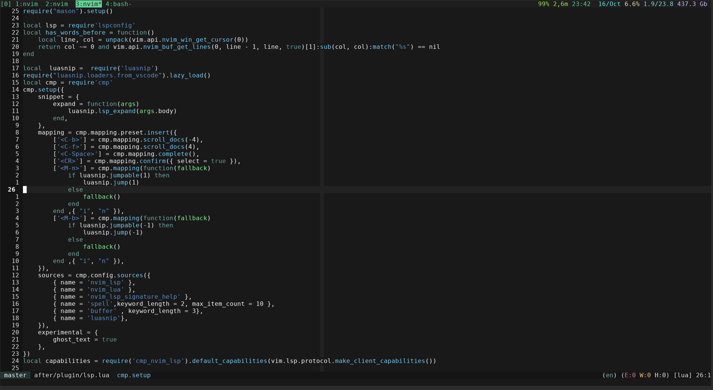

# azenburn

A simple colorscheme. Reminiscent on the normal vim theme. Based on [this post], and after some digging, some of the
colors from  this [emacs theme].

Fairly minimal, Mainly green and blue shades

Created with [rktjmp/lush.nvim] and [rktjmp/shipwright.nvim].

## Screenshots
Doesn't have that much support for other things, whatever was in lush

[this post]: https://www.reddit.com/r/vim/comments/16wc9kl/which_color_scheme_is_this/
[emacs theme]: https://github.com/magnars/.emacs.d/blob/master/themes/prez-theme.el
[rktjmp/lush.nvim]: https://github.com/rktjmp/lush.nvim
[rktjmp/shipwright.nvim]: https://github.com/rktjmp/shipwright.nvim
